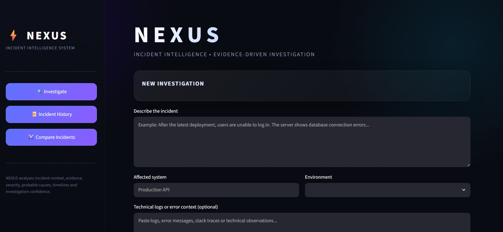
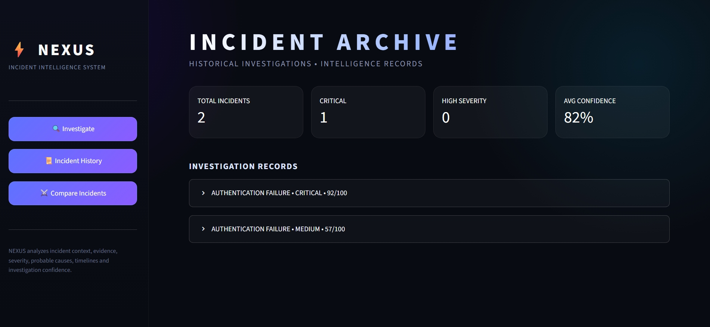
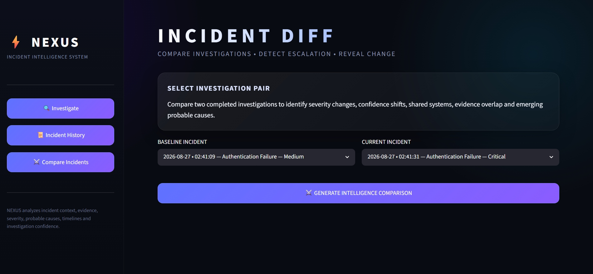

# ⚡ NEXUS

### Incident Intelligence System for Evidence-Driven Investigation

NEXUS is an incident intelligence platform designed to transform unstructured incident reports, technical context, and system evidence into a structured investigation.

Instead of simply identifying keywords, NEXUS builds an investigation pipeline that analyzes an incident across multiple dimensions — including severity, evidence, probable causes, timelines, information gaps, recommended actions, confidence, and historical comparison.

> **NEXUS does not claim to determine confirmed root causes.** Its outputs are evidence-based investigation hypotheses intended to support faster and more structured incident analysis.

---

## 🚀 Overview

Modern technical incidents often begin with fragmented information:

- A user reports that a system is failing.
- Logs contain partial error messages.
- A deployment may have recently occurred.
- Multiple systems may be affected.
- The actual cause may not yet be known.

NEXUS brings these signals together into a single structured investigation.

### Investigation Pipeline

```text
Incident Context
      ↓
Incident Classification
      ↓
Evidence Extraction
      ↓
Severity Assessment
      ↓
Probable Cause Generation
      ↓
Timeline Reconstruction
      ↓
Investigation Gap Detection
      ↓
Recommended Actions
      ↓
Investigation Confidence
      ↓
Structured Intelligence Report
```

---

# ✨ Key Capabilities

## 🔍 Incident Analysis

NEXUS analyzes incident descriptions and technical context to identify:

- Incident type
- Affected systems
- Deployment indicators
- Environment
- Technical signals
- Relevant investigation keywords

---

## 🧾 Evidence Extraction

The evidence engine extracts supporting signals from:

- Incident descriptions
- User impact statements
- Technical logs
- Deployment references
- Authentication failures
- Database failures
- Connectivity problems

Each signal contributes to a structured evidence record.

---

## 🚨 Severity Assessment

NEXUS evaluates incident severity using signals such as:

- User impact
- Production environment involvement
- Incident classification
- Available evidence
- Technical log availability

The output includes:

- Severity score
- Severity level
- Supporting severity signals

---

## 🧠 Probable Cause Analysis

NEXUS generates evidence-based investigation hypotheses.

Example hypotheses include:

- Database connectivity failure
- Deployment-related regression
- Authentication dependency failure
- Network or service connectivity issues
- Application-level regression

Each hypothesis includes:

- Confidence level
- Supporting evidence
- Suggested investigation direction

> These causes are investigation hypotheses and are not confirmed root causes.

---

## 🕒 Timeline Reconstruction

NEXUS attempts to reconstruct the observable sequence of an incident.

Example:

```text
Deployment Event
        ↓
Application Failure
        ↓
User Impact
        ↓
Dependency or Database Failure
```

This helps investigators understand incident progression.

---

## 🔎 Investigation Gap Detection

The gap engine identifies missing information that may limit investigation quality.

Potential gaps can include:

- Missing technical logs
- Unknown environment
- Unclear affected system
- Insufficient incident context
- Missing timeline indicators

---

## ⚡ Recommended Actions

Based on severity, evidence, probable causes, and investigation gaps, NEXUS generates prioritized actions.

Actions may include:

- Immediate investigation
- Incident containment
- Evidence preservation
- Deployment review
- Database investigation
- Authentication investigation
- Network investigation

---

## 🎯 Investigation Confidence

NEXUS estimates the confidence of the current investigation using factors such as:

- Evidence volume
- Technical log availability
- Timeline clarity
- Information gaps
- Strength of investigation hypotheses

This helps distinguish between:

```text
Limited Investigation Context
        ↓
Moderate Investigation Confidence
        ↓
High Investigation Confidence
```

---

## ⚔️ Incident Comparison

NEXUS can compare two previously investigated incidents to detect changes and relationships.

Comparison intelligence includes:

- Severity change
- Severity trend
- Confidence change
- Shared affected systems
- Shared evidence
- New probable causes
- Removed probable causes
- Overall similarity score

This allows NEXUS to analyze how incidents evolve over time.

---

# 🖥️ Interface

## Investigation Dashboard

The primary investigation workspace provides a structured interface for entering incident information and reviewing intelligence outputs.



---

## Incident Archive

Completed investigations are stored locally and displayed in an intelligence archive.

The archive includes:

- Total investigations
- Critical incidents
- High-severity incidents
- Average investigation confidence
- Individual investigation records
- Report download functionality



---

## Incident Comparison

The comparison workspace analyzes relationships and changes between two completed investigations.



---

# 🏗️ Architecture

```text
NEXUS
│
├── app.py
│
├── core
│   ├── incident_analyzer.py
│   ├── evidence_engine.py
│   ├── severity_engine.py
│   ├── cause_engine.py
│   ├── timeline_engine.py
│   ├── gap_engine.py
│   ├── action_engine.py
│   ├── confidence_engine.py
│   ├── comparison_engine.py
│   ├── history_manager.py
│   ├── report_engine.py
│   └── nexus_engine.py
│
├── data
│
└── assets
    └── screenshots
```

---

# ⚙️ Installation

## 1. Clone the repository

```bash
git clone https://github.com/palashgoyalatwork/NEXUS.git
cd NEXUS
```

## 2. Create a virtual environment

### Windows

```bash
python -m venv .venv
.venv\Scripts\activate
```

### macOS / Linux

```bash
python3 -m venv .venv
source .venv/bin/activate
```

## 3. Install dependencies

```bash
pip install -r requirements.txt
```

## 4. Run NEXUS

```bash
streamlit run app.py
```

The application will open in your browser.

---

# 🧪 Example Investigation

### Incident Description

```text
My Python application suddenly started failing after deployment.
Users cannot log in and the server logs show database connection errors.
```

### System

```text
Production API
```

### Environment

```text
Production
```

### Technical Logs

```text
database connection refused
```

### Example Output

```text
Incident Type:
Database Failure

Severity:
Critical — 95/100

Leading Probable Cause:
Database Connectivity Failure

Investigation Confidence:
High — 100/100
```

---

# 🛠️ Technology Stack

- Python
- Streamlit
- JSON-based local storage
- Modular investigation engines
- Rule-based evidence analysis
- Custom HTML/CSS interface styling

---

# 🎨 Design Philosophy

NEXUS is designed around a simple principle:

> **Technical incidents should be investigated as connected evidence systems, not isolated error messages.**

The project separates the investigation process into independent analytical components so that each stage can be inspected, extended, and improved independently.

The architecture is intentionally modular:

```text
Input
 ↓
Analysis Engines
 ↓
Investigation Intelligence
 ↓
Structured Report
```

This makes NEXUS suitable as a foundation for future integrations such as:

- AI-assisted investigation
- Log ingestion
- External monitoring tools
- Alert ingestion
- Incident correlation
- Team collaboration
- Persistent databases

---

# 🗺️ Future Roadmap

Potential future development includes:

- [ ] AI-assisted natural language investigation
- [ ] Advanced log parsing
- [ ] Real-time incident monitoring
- [ ] Incident correlation across systems
- [ ] Interactive investigation graphs
- [ ] Database-backed incident storage
- [ ] REST API
- [ ] Team collaboration
- [ ] Automated incident summaries
- [ ] Alert platform integrations

---

# ⚠️ Limitations

NEXUS currently uses deterministic, rule-based investigation logic.

Therefore:

- Probable causes are hypotheses, not confirmed root causes.
- Investigation confidence is an internal analytical estimate.
- Severity scoring depends on the information provided.
- NEXUS should not replace experienced incident responders or production monitoring systems.

The project is designed as an **incident intelligence and investigation assistant**, not an autonomous production decision-making system.

---

# 📄 License

This project is currently maintained as a personal portfolio and research project.

A formal open-source license may be added in a future release.

---

# 👨‍💻 Author

**Palash Goyal**

Independent AI & Software Developer

GitHub: `@palashgoyalatwork`

---

<div align="center">

### ⚡ NEXUS

**Evidence. Context. Intelligence.**

</div>